# IT Incident Response Portfolio

## Overview

This portfolio demonstrates hands-on IT Help Desk troubleshooting skills through 10 real-world incident response scenarios. Each scenario simulates a common issue encountered in a professional Help Desk environment — the problem is triggered, documented with screenshots, diagnosed, and resolved. All scenarios were performed in a live Active Directory lab environment using Windows Server 2019 and Windows 10.

---

## Tools and Technologies

| Tool | Purpose |
|---|---|
| Windows Server 2019 | Domain Controller, Active Directory, DNS, DHCP |
| Windows 10 | Client machine for simulating end-user issues |
| Oracle VirtualBox | Virtualization platform |
| Active Directory Users and Computers (ADUC) | User management and account administration |
| Command Prompt | Network diagnostics and configuration |
| Group Policy Management | Account lockout policy configuration |
| Windows Defender Firewall | Firewall rule management |
| Devices and Printers | Printer troubleshooting |

---

## Network Configuration

| Component | Details |
|---|---|
| Domain Controller (DC) | Windows Server 2019 — Internal IP: 172.16.0.1 |
| Client Machine (CLIENT1) | Windows 10 — IP: 172.16.0.101 |
| Domain | mydomain.com |
| DHCP Scope | 172.16.0.100 – 172.16.0.200 |

---

## Scenarios

---

### Scenario 1 — Account Lockout and Unlock

**Issue:** A user account was locked out after entering the wrong password too many times, triggering the domain lockout policy.

**Steps Taken:**
1. Configured Group Policy to lock accounts after 5 failed login attempts
2. Triggered lockout by entering incorrect credentials on CLIENT1
3. Identified the locked account in Active Directory Users and Computers on the DC
4. Unlocked the account by checking "Unlock account" in the user's Account properties
5. Verified successful login on CLIENT1

**Screenshots:**

**Step 1 — Account lockout error on CLIENT1**
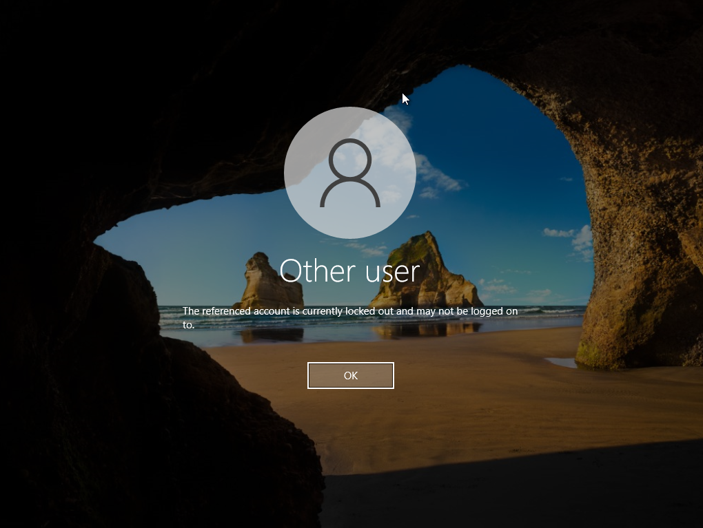
The login screen displayed a lockout message after 5 failed password attempts, confirming the Group Policy lockout threshold was triggered.

**Step 2 — Account unlocked in ADUC**

The account was located in Active Directory Users and Computers. The "Unlock account" checkbox was selected in the Account tab to restore access.

**Step 3 — Successful login after unlock**
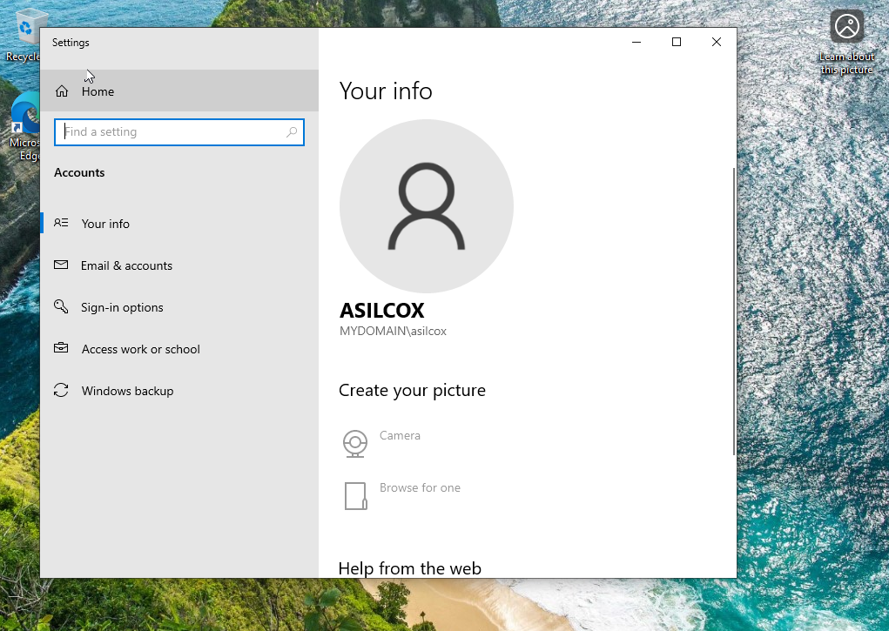
The user successfully logged into CLIENT1 after the account was unlocked, confirming the issue was resolved.

---

### Scenario 2 — Forced Password Reset

**Issue:** A user was required to change their password at next login as part of a security policy enforcement.

**Steps Taken:**
1. Located the user account in ADUC on the DC
2. Enabled "User must change password at next logon" in the Account tab
3. Logged into CLIENT1 as the user and confirmed the password change prompt appeared
4. Changed the password and verified the confirmation message
5. Confirmed successful login with the new password

**Screenshots:**

**Step 1 — Password reset checkbox enabled in ADUC**
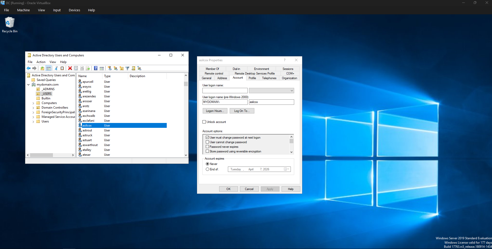
The "User must change password at next logon" option was checked in the user's Account properties in Active Directory Users and Computers.

**Step 2 — Password change prompt on CLIENT1**
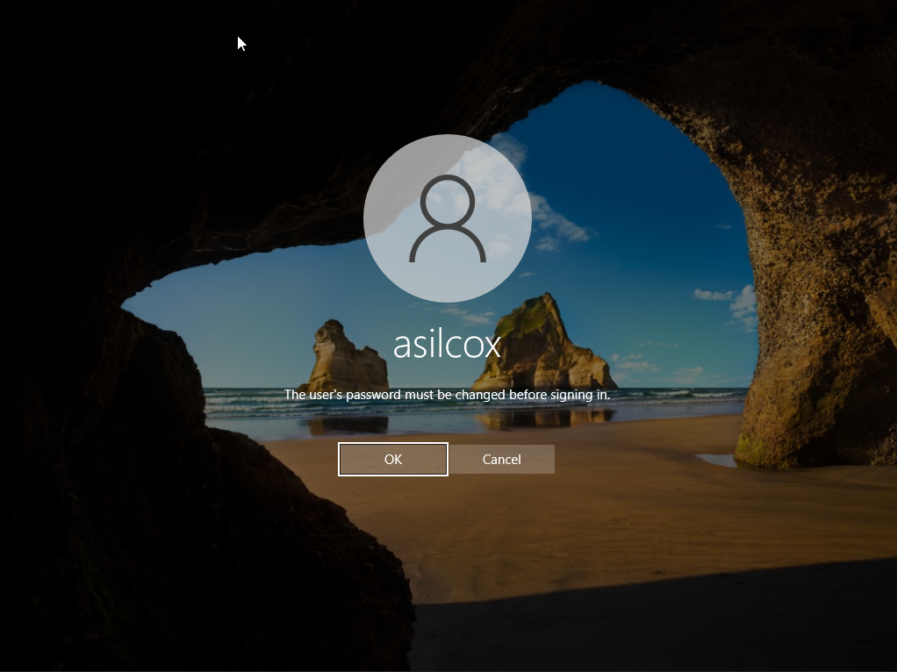
Upon logging in, the user was immediately prompted that their password must be changed before they could sign in.

**Step 3 — Password changed confirmation**
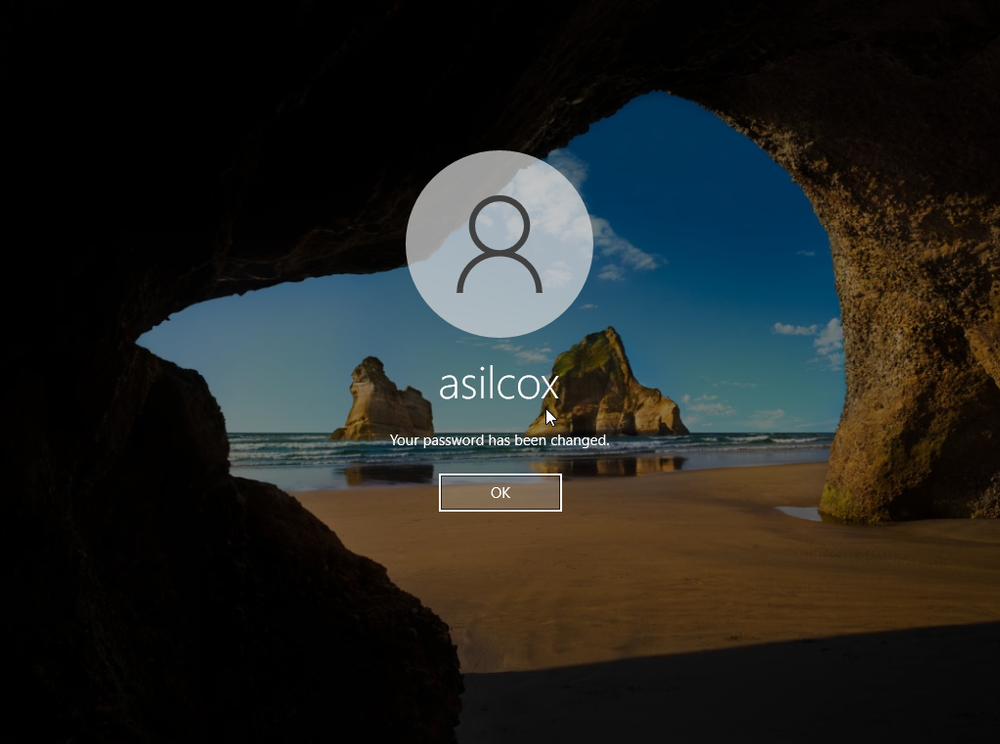
The system confirmed the password was successfully changed, and the user was able to proceed with login.

---

### Scenario 3 — Account Disabled and Reactivated

**Issue:** A user account was disabled, preventing the user from logging in. The account was later reactivated.

**Steps Taken:**
1. Located the user account (cdally) in ADUC and disabled it
2. Attempted to log in as cdally on CLIENT1 to confirm the error
3. Re-enabled the account in ADUC
4. Verified the account was successfully reactivated

**Screenshots:**

**Step 1 — Account disabled confirmation in ADUC**
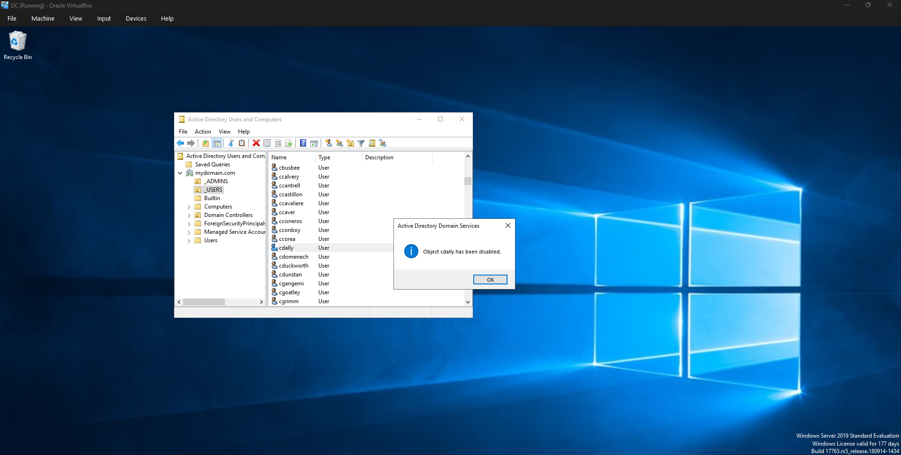
Active Directory confirmed the object had been disabled after right-clicking the user account and selecting "Disable Account."

**Step 2 — Login error on CLIENT1**
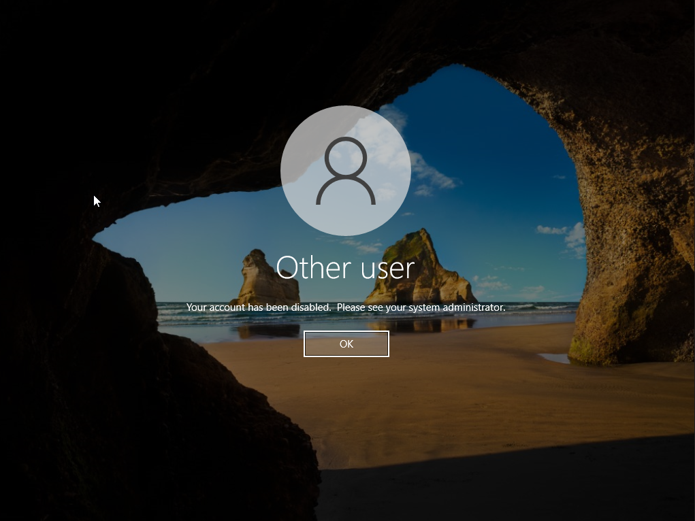
When attempting to log in on CLIENT1, the system displayed a message stating the account had been disabled and to contact the system administrator.

**Step 3 — Account re-enabled confirmation in ADUC**
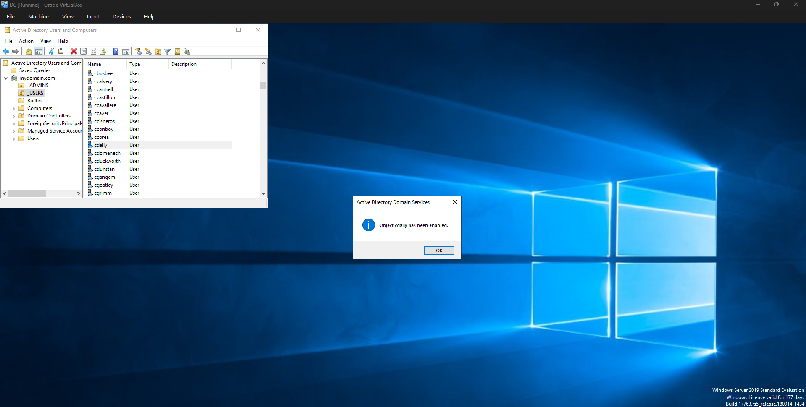
Active Directory confirmed the object had been re-enabled, restoring the user's ability to log in.

---

### Scenario 4 — New Employee Onboarding

**Issue:** A new employee needed a domain user account created and verified before their first day.

**Steps Taken:**
1. Created a new user account (newuser) in the _USERS OU in ADUC
2. Set the initial password and configured account settings
3. Verified the user appeared in the Active Directory user list
4. Logged into CLIENT1 as the new user to confirm access

**Screenshots:**

**Step 1 — New user creation form in ADUC**
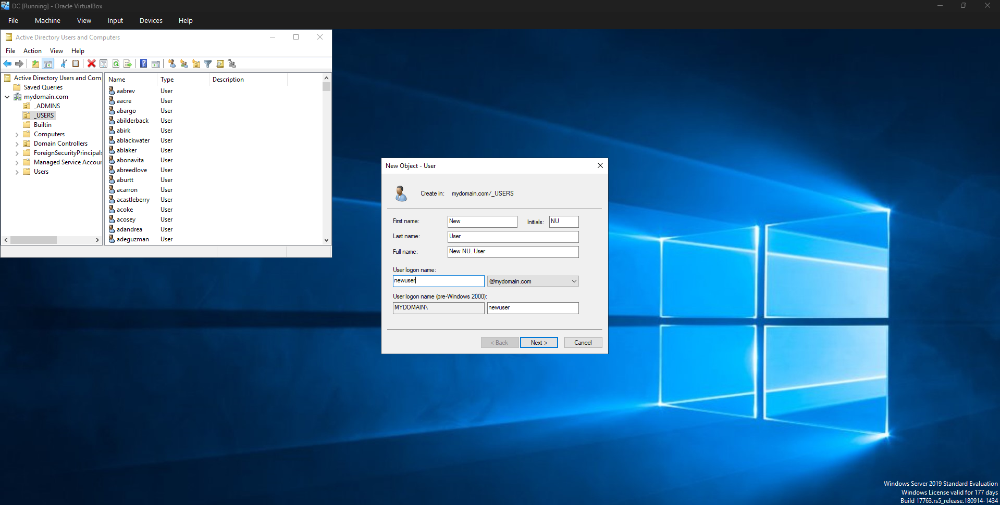
A new user account was created in the mydomain.com/_USERS organizational unit with the logon name "newuser."

**Step 2 — New user visible in ADUC**
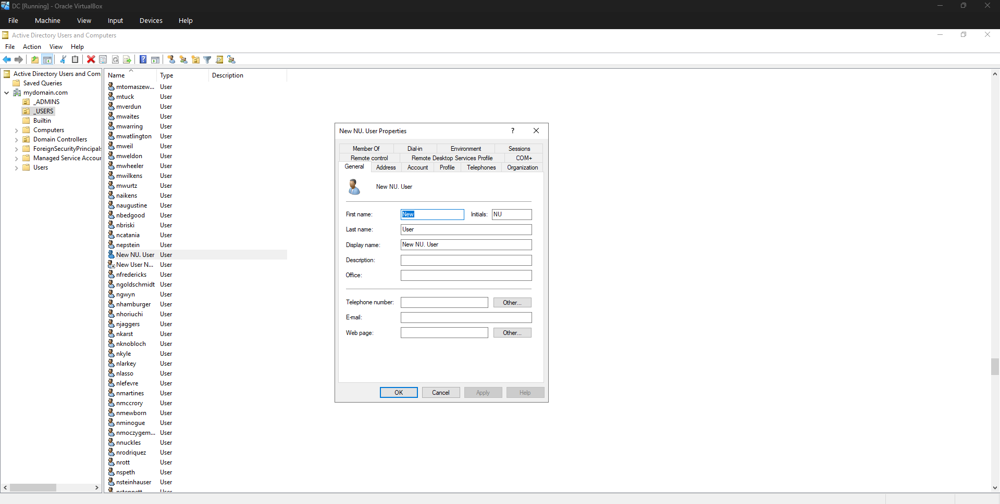
The newly created user "New NU. User" appeared in the Active Directory Users and Computers list, confirming successful account creation.

**Step 3 — Successful login as new user on CLIENT1**
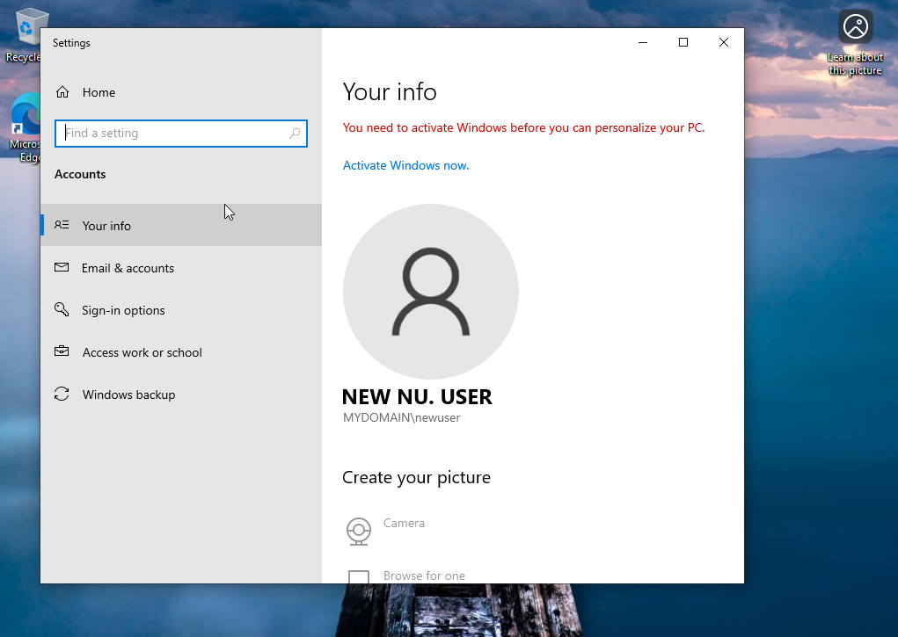
The new user successfully authenticated on CLIENT1 under MYDOMAIN\newuser, confirming the account was fully functional.

---

### Scenario 5 — DNS Not Resolving

**Issue:** A workstation was unable to resolve domain names due to an incorrect DNS server configuration.

**Steps Taken:**
1. Verified the current DNS configuration using ipconfig /all — DNS was pointing to 172.16.0.1
2. Changed the DNS server to an invalid IP address (1.2.3.4) using netsh
3. Ran ping google.com to confirm DNS resolution failure
4. Restored the correct DNS server (172.16.0.1) using netsh
5. Ran ipconfig /flushdns and re-pinged google.com to confirm resolution was restored

**Screenshots:**

**Step 1 — DNS set to fake IP, ipconfig /all output**
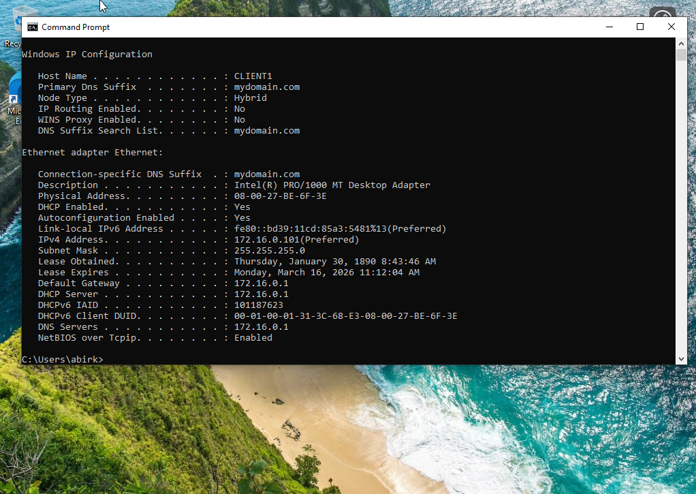
The DNS server was changed to an invalid address (1.2.3.4) using the netsh command. The system returned a warning that the configured DNS server was incorrect or does not exist.

**Step 2 — Ping google.com fails with DNS error**
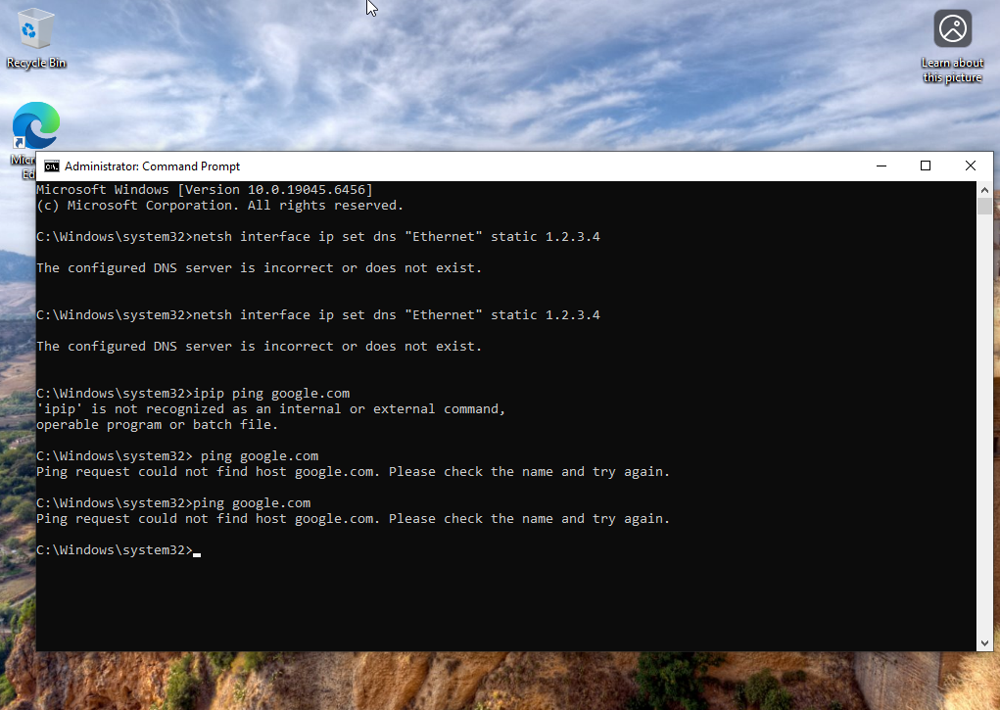
With the incorrect DNS server set, pinging google.com returned "Ping request could not find host google.com," confirming DNS resolution was broken.

**Step 3 — DNS restored, ping google.com succeeds**
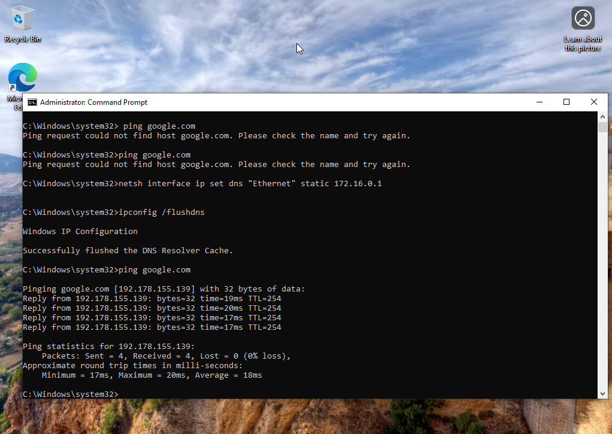
After restoring the correct DNS server and flushing the DNS cache, google.com resolved successfully with 0% packet loss.

---

### Scenario 6 — Computer Can't Connect to Network

**Issue:** A workstation lost all network connectivity after the network adapter was disabled.

**Steps Taken:**
1. Disabled the Ethernet adapter on CLIENT1 via Network Connections
2. Attempted to ping the DC (172.16.0.1) to confirm connectivity loss
3. Re-enabled the Ethernet adapter
4. Re-pinged the DC to confirm connectivity was restored

**Screenshots:**

**Step 1 — Ethernet adapter disabled**
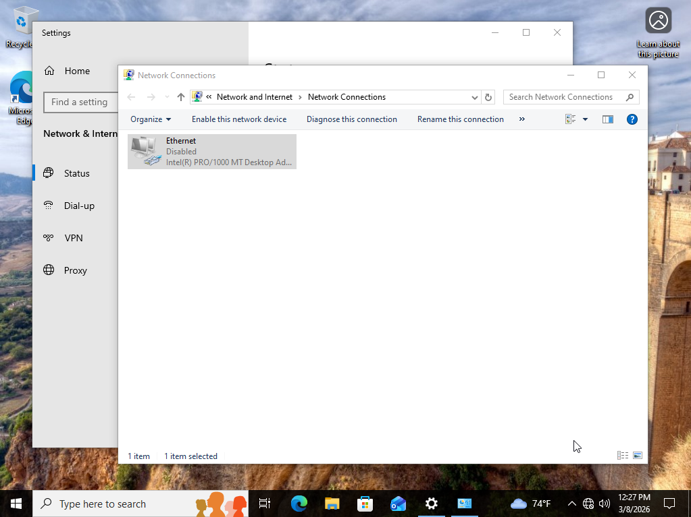
The Ethernet adapter on CLIENT1 was disabled through Network Connections, showing a "Disabled" status under the adapter.

**Step 2 — Ping failure with adapter disabled**
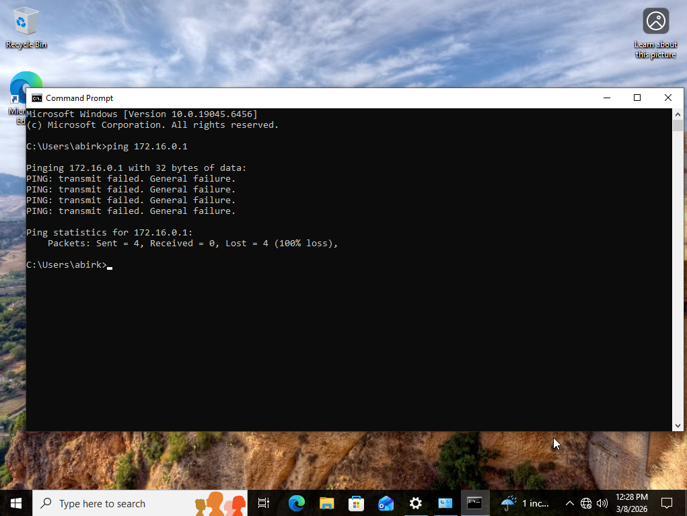
With the adapter disabled, pinging the domain controller at 172.16.0.1 returned "PING: transmit failed. General failure" with 100% packet loss.

**Step 3 — Ping success after adapter re-enabled**
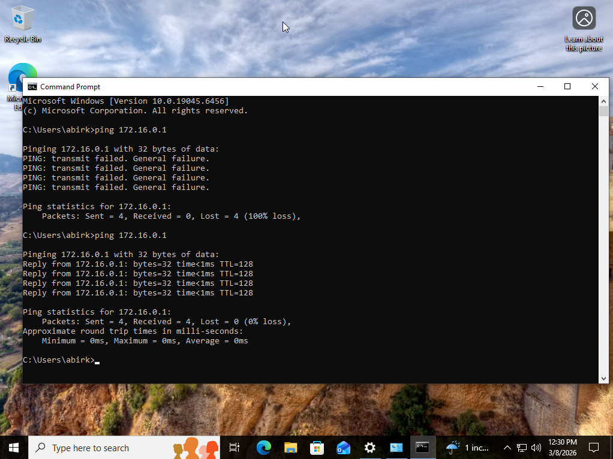
After re-enabling the Ethernet adapter, the same ping to 172.16.0.1 returned 4 successful replies with 0% packet loss, confirming full connectivity was restored.

---

### Scenario 7 — User Can't Access Shared Folder

**Issue:** A user was denied access to a shared network folder due to incorrect share permissions.

**Steps Taken:**
1. Created a shared folder (ITShare) on the DC and set permissions to deny access for the user abirk
2. Mapped the shared drive on CLIENT1 and attempted to access it
3. Confirmed the "Windows cannot access" error due to denied permissions
4. Updated the share permissions on the DC to grant Everyone full access
5. Documented the resolution

**Screenshots:**

**Step 1 — Access denied error on CLIENT1**

When attempting to open the ITShare network location, Windows displayed a Network Error stating the user did not have permission to access the share and should contact the network administrator.

**Step 2 — Permissions corrected on DC**

The share permissions for ITShare were updated on the DC to grant Everyone Full Control, Change, and Read access, resolving the permission denial.

---

### Scenario 8 — IP Address Conflict

**Issue:** A workstation was manually assigned a static IP address that conflicted with the domain controller, causing a duplicate IP conflict.

**Steps Taken:**
1. Assigned CLIENT1 a static IP of 172.16.0.1 — the same IP as the DC
2. Ran ipconfig /all to confirm Windows detected the conflict
3. Observed the "Duplicate" flag on the IPv4 address
4. Restored the adapter to DHCP configuration
5. Confirmed CLIENT1 received a clean IP address (172.16.0.101) from the DHCP server

**Screenshots:**

**Step 1 — IP conflict detected, duplicate address**
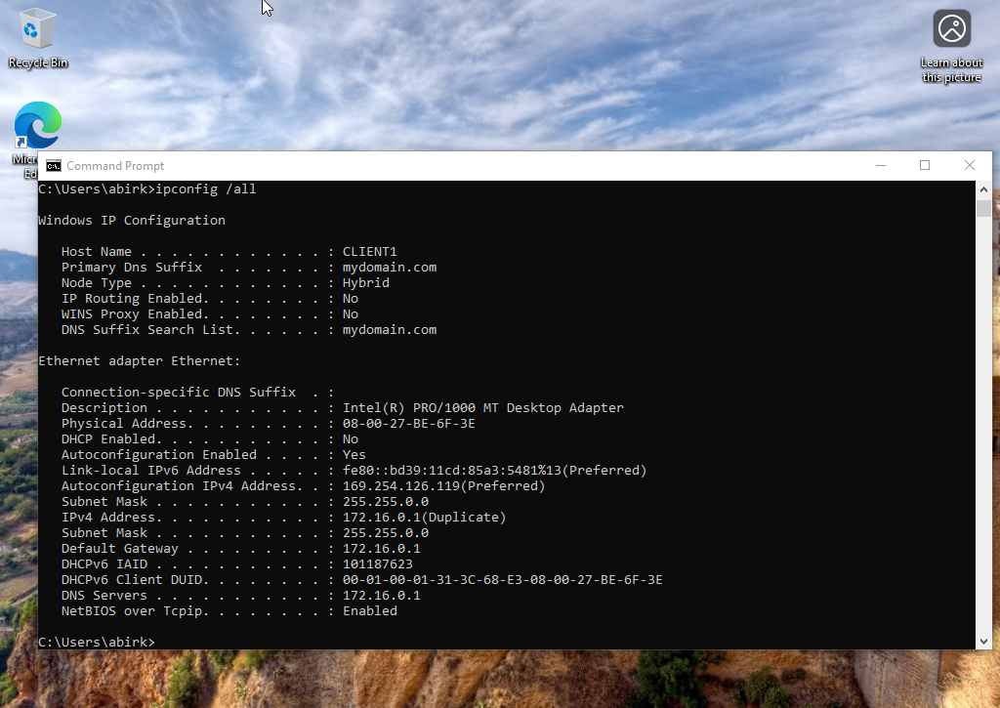
Running ipconfig /all on CLIENT1 showed the IPv4 address as 172.16.0.1(Duplicate), confirming Windows detected the conflict with the domain controller's IP address.

**Step 2 — IP conflict resolved, DHCP restored**
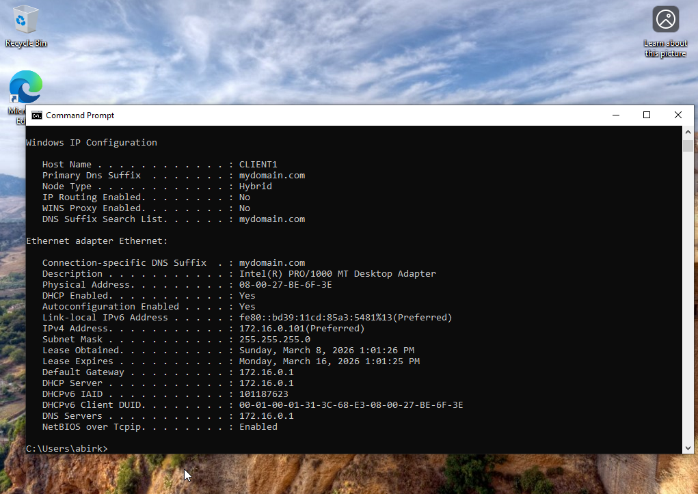
After switching back to automatic (DHCP) configuration, CLIENT1 received a clean IP address of 172.16.0.101 from the domain controller's DHCP server with no conflict.

---

### Scenario 9 — Printer Not Found

**Issue:** A user was unable to find or add a network printer on their workstation.

**Steps Taken:**
1. Opened Devices and Printers on CLIENT1 and attempted to add a printer
2. The automatic search returned "No devices found," confirming no network printer was discoverable
3. Navigated to the manual printer troubleshooting options to demonstrate the resolution path a Help Desk technician would follow
4. Documented available options including searching by name, IP address, and Bluetooth

**Screenshots:**

**Step 1 — No devices found when searching for printer**
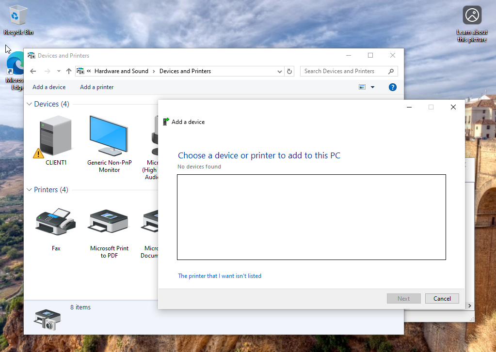
The "Add a device" wizard was launched from Devices and Printers. The automatic scan returned "No devices found," confirming no network printer was available or discoverable on the network.

**Step 2 — Manual printer troubleshooting options**
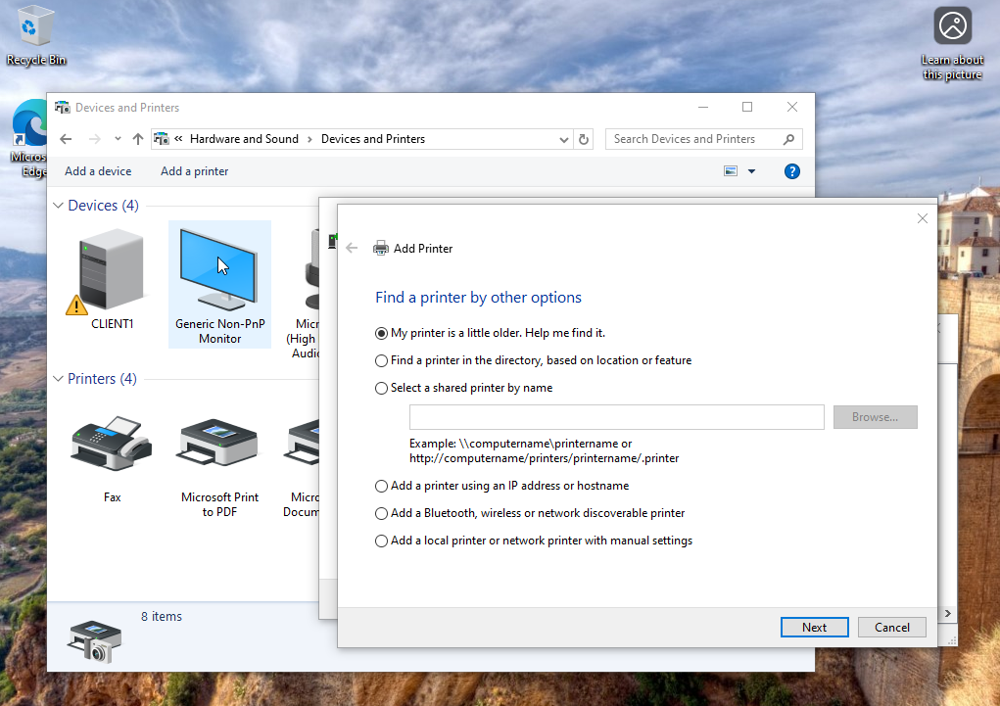
Clicking "The printer that I want isn't listed" opened the manual printer discovery options, including searching by name, IP address, hostname, and Bluetooth — the standard Help Desk troubleshooting path for printer issues.

---

### Scenario 10 — New Employee Full Onboarding Checklist

**Issue:** A new employee (John Smith) required a complete onboarding — user account creation, group membership assignment, and login verification.

**Steps Taken:**
1. Created a new domain user account (jsmith) in ADUC under the _USERS OU
2. Set the initial password and configured account settings
3. Added jsmith to the Remote Desktop Users security group
4. Logged into CLIENT1 as jsmith to verify full domain access

**Screenshots:**

**Step 1 — New user account created in ADUC**
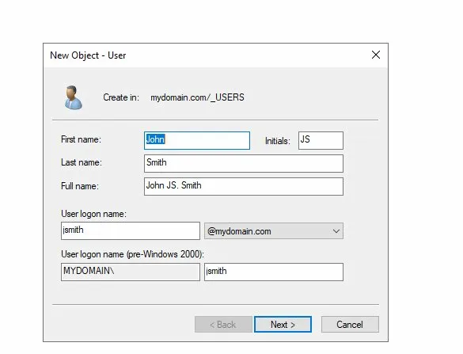
A new user account was created for John Smith with the logon name jsmith@mydomain.com in the mydomain.com/_USERS organizational unit.

**Step 2 — User added to security group**
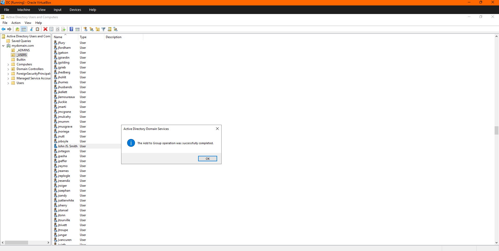
Active Directory confirmed the Add to Group operation was successfully completed, adding jsmith to the Remote Desktop Users security group.

**Step 3 — Successful login as jsmith on CLIENT1**
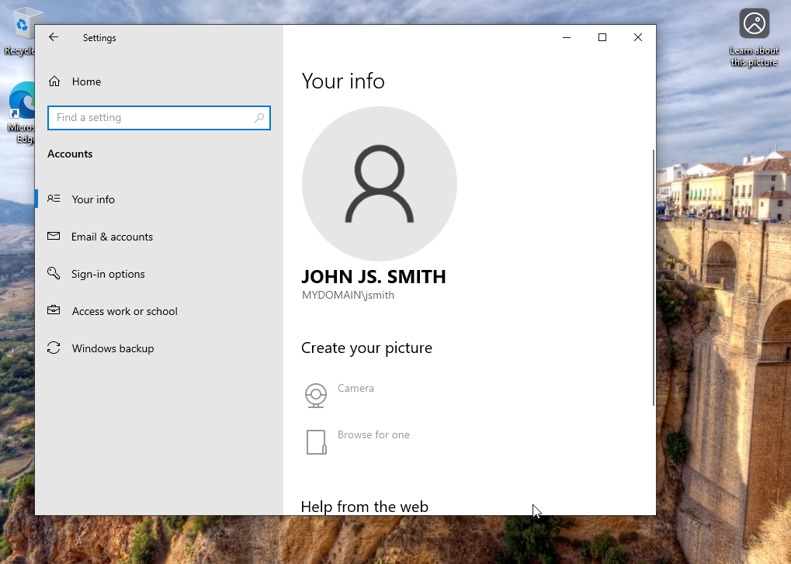
John Smith successfully authenticated on CLIENT1 under MYDOMAIN\jsmith, confirming the account was fully provisioned and ready for use.

---

## Key Skills Demonstrated

- Active Directory user account management (create, disable, unlock, reset)
- Group Policy configuration and enforcement
- DNS troubleshooting and configuration using netsh and ipconfig
- Network adapter diagnostics and connectivity verification
- IP address conflict detection and resolution
- Shared folder creation and permission management
- Printer troubleshooting and device discovery
- New employee onboarding end-to-end
- Windows 10 and Windows Server 2019 administration
- Command-line network diagnostics (ping, ipconfig, netsh, net use)
